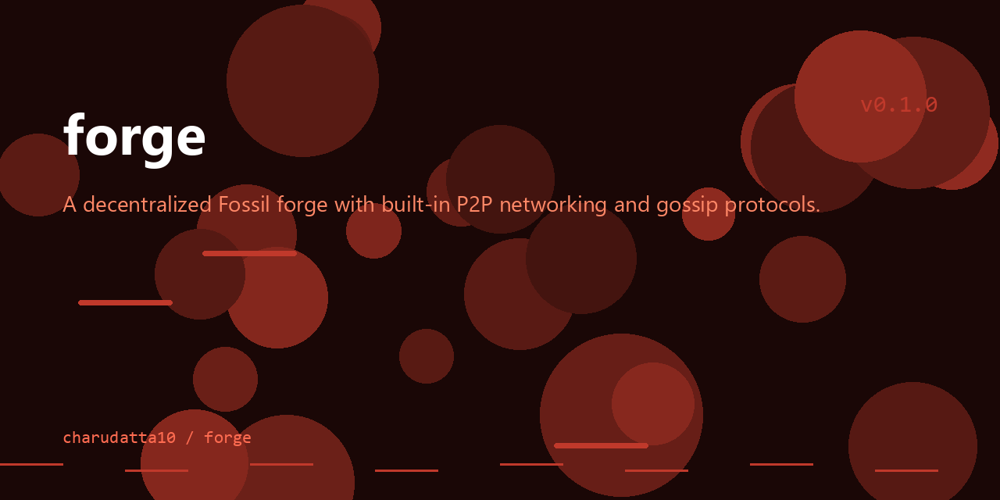

# Forge

<p align="center">
  
</p>


## What is this?

A decentralized Fossil forge with built-in P2P networking and gossip protocols, written in pure Lua.

## Features

- **Decentralized SCM**: Built on top of [Fossil](https://fossil-scm.org/), providing robust version control with a built-in wiki, ticketing, and UI.
- **P2P Networking**: Automatic peer discovery via UDP broadcast and TCP gossip protocols.
- **Zero-Config Sync**: Announce your repositories to the network and discover what others are working on.
- **Cross-Platform**: Works on Windows (via PowerShell/BusyBox) and Linux/macOS.

## Prerequisites

- **Lua 5.1+**: The core logic is written in pure Lua.
- **Fossil**: Must be in your PATH.
- **Netcat (nc)**: Required for P2P communication. On Windows, [BusyBox for Windows](https://frippery.org/busybox/) is recommended.

## Installation

Clone the repository and ensure `forge.lua` and `forge-net.lua` are in the same directory.

```bash
git clone https://github.com/charudatta10/forge.git
cd forge
```

## Usage

### 1. Initialize a Repository
Create a new decentralized repository:
```bash
lua forge.lua init my-project
```

### 2. Start the Networking Daemon
To participate in the P2P network, start the background daemon:
```bash
lua forge.lua startnet
```
This will:
- Listen for peers on TCP port `9090`.
- Broadcast and listen for discovery packets on UDP port `9999`.

### 3. Peer Management
View discovered peers:
```bash
lua forge.lua peers
```

### 4. Announcements & Gossip
Announce a repository to all known peers:
```bash
lua forge.lua announce my-project
```

Send a gossip message to the network:
```bash
lua forge.lua gossip announcements "New version released!"
```

### 5. Synchronize
Sync your local repository with Fossil and announce the update to the network:
```bash
lua forge.lua sync my-project
```

## Architecture

- `forge.lua`: The main CLI entry point. Handles repository orchestration and command routing.
- `forge-net.lua`: The networking layer. Implements TCP/UDP P2P logic using system primitives to avoid heavy dependencies.
- `.forge/`: Local data directory (stores peer keys, discovery databases, and Fossil repositories).

## Testing

Run the included unit tests to verify the networking logic:
```bash
lua tests/test_net.lua
```

## License

MIT